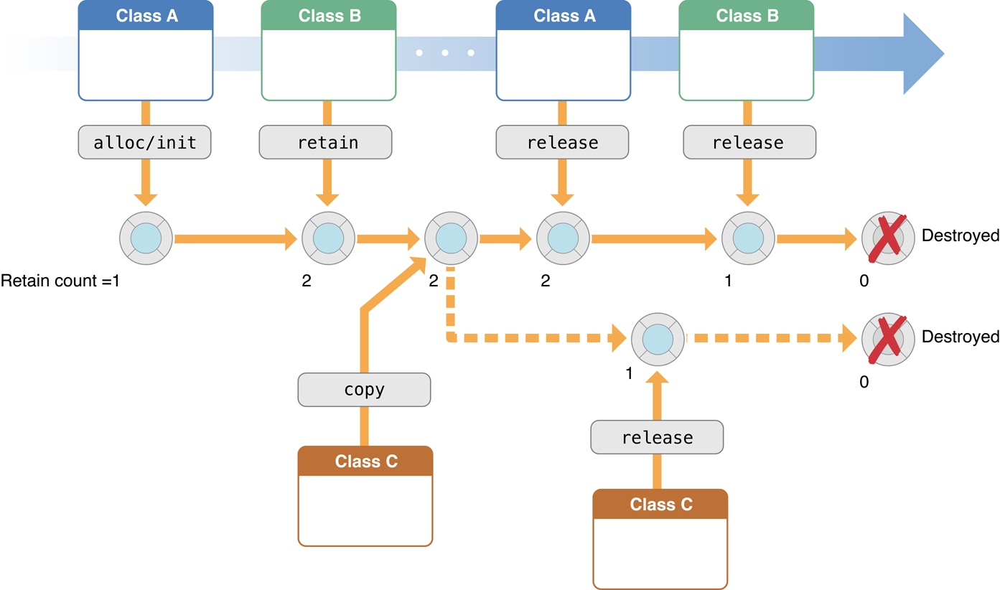

copy 会不会加引用计数? 堆中的对象肯定会。
alloc，allocWithZone：，copy，copyWithZone：，mutableCopy，mutableCopyWithZone：retain
都会+1
release，autoRelease 
减1

@"test"和类簇等为什么是-1
首先这几个都是在栈中。存储在栈中的对象没有引用计数器，因为栈有严格的生命周期，有其自己负责销毁内存；
且你没有用alloc等显式的方法是创建不需要去释放它的引用计数，所以完全交由系统处理，所以查看这种情况下的变量的引用计数是没有意义的.
同时，系统不会进行将计数从1减为0的操作，当计数为1时，再进行计数减的操作时，系统直接将该内存标记为可用，而不去进行减操作，主要也是为了节省操作次数。

-1 和 

类簇 http://blog.csdn.net/miscellaner/article/details/46427843
TestFlight

